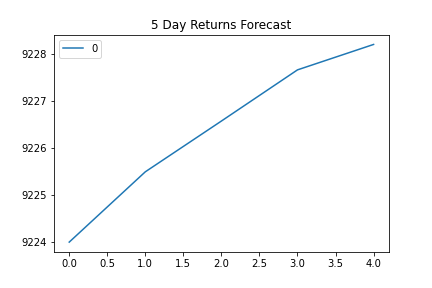

## Findings from HW 

- Overview of Yen Data:

- We created three models to forecast our returns:

  - ARMA: Using future Settle Returns
       - We see here that ARMA model predicts that the 5 day returns will settle down and be quite horizontal. 
      
      

  - ARIMA: Using Raw Yen Settle Price
       - We see here that our ARIMA model predicts our Yen prices to be on an uptrend for the next 5 days, although there is a deceleration of the trend. 
       
     

   - GARCH: Forecasting near-term volatility of Future Returns
        - This model showcases that our volatility will be increasing, which is consistent with our prior results as they show that the price will be increasing. 

              
     
     
- Our Out-of-Sample Root Mean Squared Error (RMSE) is 0.415, while our In-sample Root Mean Squared Error (RMSE) is .596.
         - Therefore, the model performs better using data that it has not worked with before.
         
     - Our model also showed that the actual returns were higher than the predicted returns, an interesting result. 

    
### Conclusions:
   - As volatility increases, so does risk, so due to this immediate increase, I would be wary about entering a position in Yen, however, there can be confidence in any investment after viewing the results of the models that were constructed. 
        
